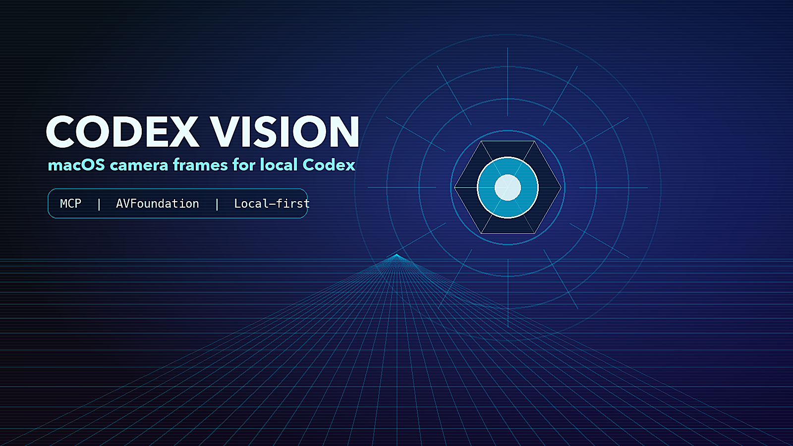
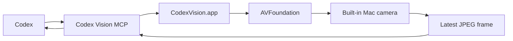

# Codex Vision

Codex Vision is a macOS-only Codex plugin that lets a local Codex session request live camera frames through MCP.

It gives Codex a tiny, explicit window into the physical world around your Mac. Not a browser camera hack. Not a cloud vision service. Not an always-on surveillance product wearing a fake mustache and pretending to be productivity software. Just a signed native macOS app, an MCP server, and a camera frame when you ask for one.

Some people will love this. Some people will absolutely hate it. Both reactions are reasonable.

If the idea of an AI assistant seeing your desk makes your soul leave your body and file a formal complaint, this plugin is not trying to convert you. Codex Vision is for the person who already trusts a local Codex session with real work and wants to say, "look at this thing," without taking a screenshot, emailing themself a photo, dragging files around, or performing the tiny office ritual where you hold a circuit board up to a laptop camera like you are negotiating with the future.

## What It Does

Version 1.0 gives Codex four explicit MCP tools:

- `codex_vision_snapshot`
- `codex_vision_start`
- `codex_vision_frame`
- `codex_vision_stop`

The user-facing slash command is intentionally small:

```text
/codex-vision snapshot
/codex-vision streaming
/codex-vision roast
```

Snapshot mode starts the camera if needed, waits for a usable JPEG frame, returns it to Codex Desktop as an image preview, and stops the camera only if snapshot started it. If the camera returns a black warm-up frame, Codex Vision keeps the camera on, waits 5 seconds, and tries again up to 3 total attempts.

Streaming mode keeps the camera session active so Codex can pull frames when visual context would help. The Mac camera indicator should stay on while streaming mode is active.

Roast mode starts the camera if needed, waits for a usable JPEG frame, stops the camera only if roast started it, and writes one opt-in playful roast of 400 characters or fewer.

To stop streaming, tell Codex to stop camera use:

```text
Codex Vision streaming off
```

The installed skill maps that request to `codex_vision_stop`.

## What It Does Not Do

Codex Vision does not implement:

- Cloud upload.
- Background recording.
- Audio capture.
- Device selection.
- Browser `getUserMedia`.
- Remote camera access.
- Automatic frame ingestion when streaming mode is off.

The camera stays local. Codex gets a JPEG frame only when it calls the snapshot or frame tool.

## Who This Is For

Codex Vision is for local-first Codex users who want the assistant to inspect physical things near the computer.

It is useful when the thing you need help with is real, visible, and annoying to describe:

- A handwritten note that says either `token` or `toker`, and unfortunately the distinction matters.
- A breadboard where one jumper wire is doing interpretive dance.
- A router light pattern that appears to be communicating in passive aggression.
- A whiteboard diagram that made sense during the meeting and has since become a corporate cave painting.
- A printed error code on a device whose manufacturer believed fonts were a moral weakness.
- A desk setup where the cable situation has entered its final form.
- A receipt, shipping label, part number, serial number, or sticker that you do not want to retype.
- A physical prototype where you need another set of eyes and those eyes can also read Swift.

It is not for people who want their camera to be completely absent from their AI workflow. That is a good boundary. Keep it. This plugin is deliberately explicit because the camera is not a casual permission.

## Install

Codex Vision requires macOS, Swift, Xcode command line tools, the Codex CLI, and an Apple Development signing identity for a real local install.

```bash
git clone https://github.com/zfifteen/codex-vision.git
cd codex-vision
scripts/install-local.sh
```

Restart Codex after installation.

For CI or package validation environments that do not have Codex configured or a signing identity installed, use dry-run mode:

```bash
scripts/install-local.sh --dry-run
```

Dry-run validates manifests and runs a release build. It does not register the plugin, sign the app bundle, or touch the local Codex plugin cache.

## Prompt Codex To Install This

If you are asking Codex to install the plugin for you, use a prompt like this:

```text
Clone https://github.com/zfifteen/codex-vision into ~/IdeaProjects/codex-vision, inspect CODEX_INSTALL.md, run scripts/install-local.sh, and verify the plugin manifests parse as JSON.
```

## Slash Commands

Ask Codex:

```text
Use Codex Vision to start the camera, inspect the latest frame, and tell me what you can read from my note.
```

Take one image and turn the camera off:

```text
/codex-vision snapshot
```

Use this when you want one usable image and then want the camera off. Codex Desktop should show the returned image as a preview thumbnail in the chat.

Start streaming mode and keep the camera available:

```text
/codex-vision streaming
```

Use this when Codex may need to inspect more than one moment in time. While streaming mode is active, Codex can pull frames as needed without asking for each frame. The camera indicator should stay on while this mode is active.

Stop streaming mode and release the camera:

```text
Codex Vision streaming off
```

You can also say `stop streaming` or `turn off the camera`. Codex maps those requests to `codex_vision_stop`.

Take one image and request immediate emotional damage, responsibly:

```text
/codex-vision roast
```

Roast mode uses the same camera lifecycle as snapshot mode: start, wait for one usable frame, stop. The roast is short, opt-in, and based only on visible non-sensitive details such as outfit, posture, expression, lighting, or room chaos. It should not infer or attack protected traits, body size, age, disability, or other sensitive attributes. It is a tiny comedy mode, not a license to become a municipal cruelty department.

## Example Workflows

Read something in the room:

```text
/codex-vision snapshot

What does the label on this device say?
```

Debug a physical setup:

```text
/codex-vision streaming

Watch this prototype while I press the button. Tell me whether the status LED changes.
```

Use it as the least glamorous lab assistant ever hired:

```text
/codex-vision snapshot

Is this connector seated correctly, or am I about to spend 45 minutes blaming software for a cable problem?
```

Use it for desk archaeology:

```text
/codex-vision snapshot

Find the sticky note with the part number and read it back to me.
```

Use it for gentle accountability:

```text
/codex-vision snapshot

Does my whiteboard plan contain an actual architecture, or did I draw six boxes and hope confidence would do the rest?
```

Use it when you have made the bold choice to ask your computer for fashion notes:

```text
/codex-vision roast

Roast me in 400 characters or fewer.
```

The plugin cannot touch objects, move the camera, choose a different camera, or infer anything outside the returned image. If the camera cannot see it, Codex Vision cannot see it either. This is still software, not a dramatic scene from a hacking movie.

## Architecture



The plugin package contains:

- `.codex-plugin/plugin.json`
- `.mcp.json`
- `commands/codex-vision.md`
- `skills/camera-control/SKILL.md`
- `dist/CodexVision.app`
- `dist/codex-vision-mcp`

The native app owns the camera permission. The MCP wrapper launches the signed app bundle and bridges JSON-RPC over named FIFOs. This preserves the macOS app identity that Camera permission is attached to.

The installer stages the plugin under `~/plugins/codex-vision`, caches it under `~/.codex/plugins/cache/local/codex-vision/1.0.0`, registers the home-local marketplace in `~/.codex/config.toml`, and runs a Codex admission check before exiting.

## Camera Modes

Snapshot mode:

1. Codex calls `codex_vision_snapshot`.
2. `CodexVision.app` starts the built-in camera if it is not already running.
3. The app waits for a usable frame.
4. The app returns one JPEG frame.
5. If snapshot started the camera, the app stops the camera and clears cached frame state. If streaming was already active, the app leaves streaming active.

Roast mode:

1. Codex calls `codex_vision_snapshot`.
2. `CodexVision.app` starts the built-in camera if it is not already running.
3. The app waits for and returns one usable JPEG frame.
4. If roast started the camera, the app stops the camera and clears cached frame state. If streaming was already active, the app leaves streaming active.
5. Codex writes a short opt-in roast based on visible non-sensitive details.

Streaming mode:

1. Codex calls `codex_vision_start`.
2. `CodexVision.app` keeps a capture session active.
3. Codex calls `codex_vision_frame` whenever visual context would help.
4. Codex calls `codex_vision_stop` when the user asks to stop camera use.

The user-visible invariant is simple: snapshot should blink the camera on briefly; streaming should keep the camera indicator on until stopped.

## Privacy

Codex Vision is explicit and pull-based. Snapshot mode starts the camera only for one frame. Streaming mode starts only when Codex calls `codex_vision_start`; frames are returned only when Codex calls `codex_vision_frame`; the session stops when Codex calls `codex_vision_stop`.

macOS asks for camera permission for the signed `CodexVision.app` the first time the capture session starts. Repeated prompts usually mean the app identity changed and the local installer should be rerun.

Version 1.0 does not implement background recording, cloud upload, device selection, audio capture, or unsolicited streaming into Codex context.

See [PRIVACY.md](PRIVACY.md) for the standalone policy.

## Development

Run the test suite:

```bash
swift test
```

Build the release executable:

```bash
swift build -c release
```

Validate manifests and release build without installing:

```bash
scripts/install-local.sh --dry-run
```

Build a release archive:

```bash
scripts/package-release.sh
```

## Troubleshooting

If the slash command does not appear, verify the local plugin cache exists:

```bash
ls ~/.codex/plugins/cache/local/codex-vision/1.0.0
```

If macOS repeatedly asks for camera permission, rerun the installer. Camera permission is tied to the signed `CodexVision.app` identity.

If streaming says it started but the camera indicator is off, the MCP process is not being kept alive. Streaming mode requires a persistent MCP session.

If frames are unavailable immediately after starting streaming, wait briefly and pull again. The installed skill retries at most two times before telling the user the camera is not producing frames.

If snapshot or roast mode sees a black frame, it treats that as camera warm-up, keeps the camera on, waits 5 seconds, and tries again. After 3 black-frame attempts, it returns an error instead of handing Codex a useless image.

## License

MIT
