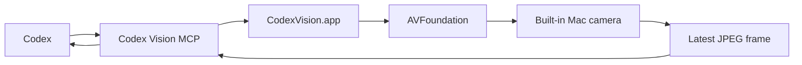

# Codex Vision

Codex Vision is a macOS-only Codex plugin that lets a local Codex session request live camera frames through MCP.

Version 1.0 gives Codex four explicit tools:

- `codex_vision_snapshot`
- `codex_vision_start`
- `codex_vision_frame`
- `codex_vision_stop`

The camera stays local. Codex gets a JPEG frame only when it calls the snapshot or frame tool.

## Install

```bash
git clone https://github.com/zfifteen/codex-vision.git
cd codex-vision
scripts/install-local.sh
```

Restart Codex after installation.

## Prompt Codex To Install This

```text
Clone https://github.com/zfifteen/codex-vision into ~/IdeaProjects/codex-vision, inspect CODEX_INSTALL.md, run scripts/install-local.sh, and verify the plugin manifests parse as JSON.
```

## Usage

Ask Codex:

```text
Use Codex Vision to start the camera, inspect the latest frame, and tell me what you can read from my note.
```

Codex Vision installs one slash command with two public modes:

```text
/codex-vision snapshot
/codex-vision streaming
```

Snapshot mode starts the camera, returns one JPEG frame, and stops the camera. In Codex Desktop the returned image appears as an image preview in the chat.

Streaming mode keeps the camera on so Codex can pull frames as needed without asking for each frame. The Mac camera indicator should stay on while streaming mode is active. To stop streaming, ask Codex to stop camera use:

```text
Codex Vision streaming off
```

There is no public `/codex-vision frame` or `/codex-vision stop` slash mode in version 1.0. Frame pulls and stop calls are MCP tool actions Codex performs from the installed skill.

## Architecture



The plugin package contains `.codex-plugin/plugin.json`, `.mcp.json`, slash commands, a skill file, and a staged app bundle built by `scripts/install-local.sh`. The installer also registers the home-local marketplace in `~/.codex/config.toml` so Codex Desktop can discover `codex-vision@local`.

## Privacy

Codex Vision is explicit and pull-based. Snapshot mode starts the camera only for one frame. Streaming mode starts only when Codex calls `codex_vision_start`; frames are returned only when Codex calls `codex_vision_frame`; the session stops when Codex calls `codex_vision_stop`.

macOS asks for camera permission for the signed `CodexVision.app` the first time the capture session starts. Repeated prompts usually mean the app identity changed and the local installer should be rerun.

Version 1.0 does not implement background recording, cloud upload, device selection, audio capture, or unsolicited streaming into Codex context.

See [PRIVACY.md](PRIVACY.md) for the standalone policy.

## Development

```bash
swift test
swift build -c release
scripts/install-local.sh --dry-run
```

## License

MIT
