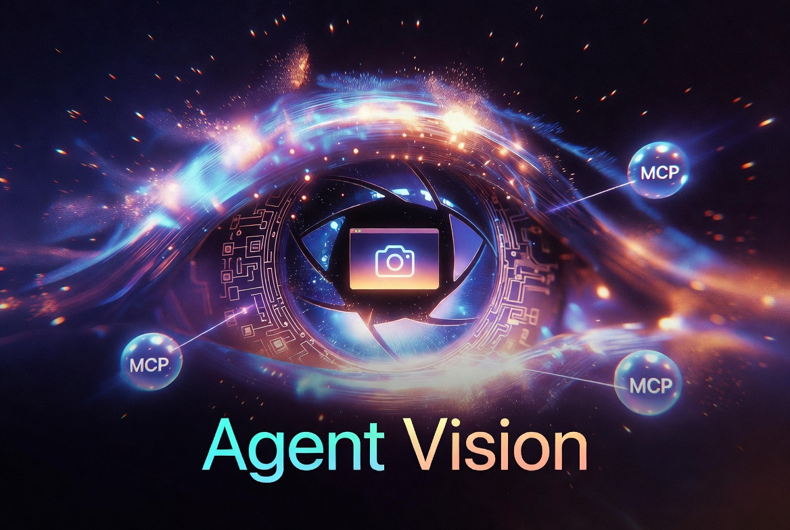
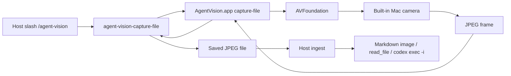

# Agent Vision

Agent Vision is a macOS-only local camera appliance for AI coding agents. A signed native app captures one explicit JPEG frame when you ask; the host adapter (Codex or Grok Build) materializes that file and inspects it through a proven local path.

Not a browser camera hack. Not a cloud vision service. Not an always-on surveillance product. Just a signed `AgentVision.app` and a local JPEG when you invoke `/agent-vision`.

Some people will love this. Some people will absolutely hate it. Both reactions are reasonable.

If the idea of an AI assistant seeing your desk makes your soul leave your body and file a formal complaint, this plugin is not trying to convert you. Agent Vision is for people who already trust a local assistant with real work and want to say, "look at this thing," without screenshot gymnastics.

## Hosts

| Host | Status | Features | Frames | Install |
| --- | --- | --- | --- | --- |
| **Codex** | Stable (package **1.5.0**) | snapshot, roast, mood; streaming disabled | `~/.codex/agent-vision/frames` | Packaged release + `install.sh` |
| **Grok Build** | Public **Ship A** (package **1.5.0**) | **snapshot** only; streaming disabled; no roast/mood yet | `~/.agent-vision/frames` | Release package or clone: `install-runtime.sh` + `install-grok.sh` |

Both hosts share package version **1.5.0**. Roast/mood on Grok remain Milestone 2.

Shared on both hosts: signed `AgentVision.app`, one-shot capture helper, no production MCP server, no camera process on install/idle/unrelated prompts.

Design notes: [docs/agent-vision-grok-build-compatibility.md](docs/agent-vision-grok-build-compatibility.md).

## What It Does

Installing, enabling, or idling the host must **not** start `agent-vision-mcp`, `AgentVision.app`, or any Agent Vision camera-capable helper. The camera runs only for an explicit one-shot slash command.

### Slash command

```text
/agent-vision snapshot
/agent-vision streaming
/agent-vision roast    # Codex only (Grok: Milestone 2)
/agent-vision mood     # Codex only (Grok: Milestone 2)
```

**Snapshot** starts the camera if needed, waits for a usable JPEG, saves it under the host frame directory, displays it (Markdown image link; Grok also uses multimodal `read_file`), and stops the camera. Black warm-up frames: keep camera on, wait 5 seconds between attempts, up to 3 attempts.

**Streaming** is disabled on both hosts. Fixed message; **no process** launched. Stop-streaming requests also launch no process.

**Roast** (Codex): snapshot + `codex exec -i` playful roast (≤400 characters, non-sensitive details only).

**Mood** (Codex): snapshot + `codex exec -i` strict JSON for response-delivery calibration only (silent by default; does not change facts, permissions, approvals, intent, or task scope).

## What It Does Not Do

Agent Vision does not implement:

- Cloud upload.
- Background recording.
- Audio capture.
- Device selection.
- Browser `getUserMedia`.
- Remote camera access.
- Automatic frame ingestion.
- Mood history, training datasets, background mood detection, or a separate image archive.

The camera stays local. Snapshot (and Codex roast/mood) use a saved JPEG file as the user-visible image contract.

## Who This Is For

Agent Vision is for local-first Codex or Grok Build users who want the assistant to inspect physical things near the computer.

It is useful when the thing you need help with is real, visible, and annoying to describe:

- A handwritten note that says either `token` or `toker`, and unfortunately the distinction matters.
- A breadboard where one jumper wire is doing interpretive dance.
- A router light pattern that appears to be communicating in passive aggression.
- A whiteboard diagram that made sense during the meeting and has since become a corporate cave painting.
- A printed error code on a device whose manufacturer believed fonts were a moral weakness.
- A desk setup where the cable situation has entered its final form.
- A receipt, shipping label, part number, serial number, or sticker that you do not want to retype.
- A physical prototype where you need another set of eyes and those eyes can also read Swift.

It is not for people who want their camera to be completely absent from their AI workflow. That is a good boundary. Keep it. This plugin is deliberately explicit because the camera is not a casual permission.

## Install

### Codex (stable package)

Ask Codex to install Agent Vision from the repository URL:

```text
Install Agent Vision from https://github.com/zfifteen/agent-vision
```

Codex should download the packaged release from that repository, extract it, run the package `install.sh`, and then open a new Codex session so `/agent-vision` is loaded.

For QA evidence that the install and uninstall lifecycle maps to the available OpenAI/Codex plugin guidance, see [docs/agent-vision-install-uninstall-traceability.md](docs/agent-vision-install-uninstall-traceability.md).

Manual package install:

```bash
curl -L -o agent-vision-1.5.0.tar.gz https://github.com/zfifteen/agent-vision/releases/download/v1.5.0/agent-vision-1.5.0.tar.gz
tar -xzf agent-vision-1.5.0.tar.gz
cd agent-vision-1.5.0
./install.sh
```

### Grok Build (Ship A)

Grok Build support is public as **Ship A** in **1.5.0**: **snapshot** + disabled streaming. Roast and mood are not available on Grok yet (Milestone 2).

From the packaged release (or a clone with signed `dist/AgentVision.app`):

```bash
# 1) Shared runtime (signed app + capture helper + PATH shim)
scripts/install-runtime.sh

# 2) Grok skill (+ optional user plugin tree under ~/.grok)
scripts/install-grok.sh
```

Ensure `~/.local/bin` is on your `PATH` so `agent-vision-capture-file` resolves. Open a **new** Grok session with **sandbox off** (default), then:

```text
/agent-vision snapshot
```

Frames: `~/.agent-vision/frames`. Uninstall: `scripts/uninstall-grok.sh` (adapter) and/or `scripts/uninstall-runtime.sh` (camera runtime).

See [INSTALL.md](INSTALL.md) and [docs/agent-vision-grok-install-uninstall-traceability.md](docs/agent-vision-grok-install-uninstall-traceability.md).

## Prompt Codex To Install This

If you are asking Codex to install the plugin for you, use a prompt like this:

```text
Install Agent Vision from https://github.com/zfifteen/agent-vision. Use the packaged release archive from the repo releases, not the source/developer installer. Extract the archive, run ./install.sh, and open a new Codex session before using /agent-vision. Confirm install and idle Codex startup create no Agent Vision process.
```

## Slash Commands

Ask Codex:

```text
Use Agent Vision to start the camera, inspect the latest frame, and tell me what you can read from my note.
```

Take one image and turn the camera off:

```text
/agent-vision snapshot
```

Use this when you want one usable image and then want the camera off. Codex should show the saved JPEG through an absolute Markdown image link.

Streaming mode is temporarily disabled:

```text
/agent-vision streaming
```

This launches no Agent Vision process in 1.5.0. The command returns the temporary disabled message.

Stop streaming:

```text
Agent Vision streaming off
```

You can also say `stop streaming` or `turn off the camera`. In 1.5.0, Codex reports that there is no Agent Vision streaming session to stop and launches no Agent Vision process.

Take one image and request immediate emotional damage, responsibly:

```text
/agent-vision roast
```

Roast mode uses the same camera lifecycle as snapshot mode, then adds a short text response. The roast is opt-in and based only on visible non-sensitive details such as outfit, posture, expression, lighting, or room chaos. It should not infer or attack protected traits, body size, age, disability, or other sensitive attributes. It is a tiny comedy mode, not a license to become a municipal cruelty department.

## Example Workflows

Read something in the room:

```text
/agent-vision snapshot

What does the label on this device say?
```

Debug a physical setup:

```text
/agent-vision snapshot

Compare this prototype state to the expected wiring and tell me what looks wrong.
```

Use it as the least glamorous lab assistant ever hired:

```text
/agent-vision snapshot

Is this connector seated correctly, or am I about to spend 45 minutes blaming software for a cable problem?
```

Use it for desk archaeology:

```text
/agent-vision snapshot

Find the sticky note with the part number and read it back to me.
```

Use it for gentle accountability:

```text
/agent-vision snapshot

Does my whiteboard plan contain an actual architecture, or did I draw six boxes and hope confidence would do the rest?
```

Use it when you have made the bold choice to ask your computer for fashion notes:

```text
/agent-vision roast

Roast me in 400 characters or fewer.
```

The plugin cannot touch objects, move the camera, choose a different camera, or infer anything outside the returned image. If the camera cannot see it, Agent Vision cannot see it either. This is still software, not a dramatic scene from a hacking movie.

Estimate current interaction state for response delivery:

```text
/agent-vision mood
```

Mood mode is opt-in. It uses the same saved JPEG frame path as snapshot and roast, then asks a separate image-input Codex pass for strict JSON. The captured image and JSON are internal control signals and are not displayed in the normal response. Low-confidence or unusable images return `uncertain` or `absent` and do not apply state-specific response shaping. User correction overrides the visual estimate for the current response or task phase.

## Architecture



| Layer | Location |
| --- | --- |
| Shared runtime | `AgentVision.app` + `agent-vision-capture-file` (Codex plugin cache and/or `~/.local/share/agent-vision`) |
| Codex host | `.codex-plugin/`, `commands/`, `skills/camera-control/` |
| Grok host | `hosts/grok/` skill + `plugin.json` |

The native app owns camera permission. Capture launches the signed app only for explicit one-shot requests, writes one JPEG to an absolute path, and prints JSON. Host adapters never depend on production MCP image content for the user-visible contract.

**Codex package install** stages under `~/plugins/agent-vision` and `~/.codex/plugins/cache/local/agent-vision/1.5.0`, registers `agent-vision@local`, and removes legacy MCP config.

**Grok install** is two-step: shared runtime home + PATH shim, then skill under `~/.grok/skills/agent-vision`.

## Camera Modes

Snapshot mode:

1. Codex runs `agent-vision-capture-file --output "$OUTPUT" --json`.
2. The file materializer launches `AgentVision.app capture-file`.
3. `AgentVision.app` starts the built-in camera if it is not already running.
4. The app waits for and returns one usable JPEG frame.
5. The file materializer writes the JPEG to `$OUTPUT` and prints JSON with `ok: true`.
6. Codex displays the saved JPEG with an absolute Markdown image link.

Roast mode:

1. Codex runs `agent-vision-capture-file --output "$OUTPUT" --json`.
2. The file materializer writes one usable JPEG to `$OUTPUT`.
3. Codex runs `codex exec --ephemeral --skip-git-repo-check -i "$OUTPUT" -- "...roast prompt..."`.
4. Codex returns the saved JPEG link and the roast text from that image-input pass.

Mood mode:

1. Codex runs `agent-vision-capture-file --output "$OUTPUT" --json`.
2. The file materializer writes one usable JPEG to `$OUTPUT`.
3. Codex runs `codex exec --ephemeral --skip-git-repo-check -i "$OUTPUT" -- "...mood JSON prompt..."`.
4. Codex parses the strict JSON from that image-input pass.
5. Codex applies permitted response-shape adjustments only to the current response or task phase.
6. Codex does not display the captured image, raw JSON, confidence band, or visual-analysis rationale unless the user explicitly asks to debug mood mode.

Streaming is disabled on both hosts. `/agent-vision streaming`, `stop streaming`, and `turn off the camera` launch no Agent Vision process.

**Invariant:** explicit snapshot (and Codex roast/mood) may blink the camera briefly; install, idle host startup, unrelated prompts, streaming, and stop-streaming create **no** Agent Vision process.

## Privacy

One-shot and explicit. No production Agent Vision MCP server. No streaming session. macOS asks for camera permission for signed `AgentVision.app` on first capture. Repeated prompts usually mean the app identity changed—rerun the relevant installer.

See [PRIVACY.md](PRIVACY.md).

## Development

```bash
swift test
swift build -c release
scripts/install-local.sh --dry-run          # Codex source install checks
scripts/test-slash-commands.sh              # Codex slash matrix
scripts/test-grok-adapter.sh                # Grok static contracts
AGENT_VISION_LIVE=1 scripts/test-capture-file-cli.sh   # optional live capture
scripts/install-runtime.sh --dry-run
scripts/install-grok.sh --dry-run
```

Build a Codex release archive:

```bash
AGENT_VISION_SIGN_IDENTITY="Developer ID Application: Your Name (TEAMID)" \
scripts/package-release.sh
```

Uninstall Codex local plugin: `scripts/uninstall-local.sh`.  
Uninstall Grok adapter / runtime: `scripts/uninstall-grok.sh`, `scripts/uninstall-runtime.sh`.

Source Codex install builds and signs locally (Swift, Xcode CLT, signing identity). Packaged Codex install is the default for end users. Grok currently installs from a repo tree that already contains a signed `dist/AgentVision.app`.

## Troubleshooting

**Codex — slash missing**

```bash
ls ~/.codex/plugins/cache/local/agent-vision/1.5.0
```

Open a new Codex session after install.

**Grok — slash missing or capture helper not found**

```bash
echo "$PATH" | tr ':' '\n' | grep local/bin
ls ~/.local/bin/agent-vision-capture-file
ls ~/.local/share/agent-vision/dist/agent-vision-capture-file
ls ~/.grok/skills/agent-vision/SKILL.md
```

Re-run `scripts/install-runtime.sh` and `scripts/install-grok.sh`. Put `~/.local/bin` on `PATH`. Open a **new** Grok session. Use **sandbox off**.

**Camera permission loops** — rerun the installer that staged `AgentVision.app` (identity changed).

**Streaming** — disabled on both hosts; no process should start.

**Black frames** — warm-up retries (3 attempts, 5s apart), then error instead of a useless JPEG.

## License

MIT
