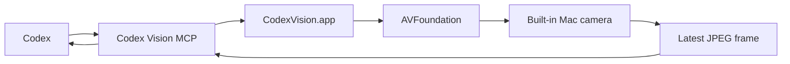

# Codex Vision

Codex Vision is a macOS-only Codex plugin that lets a local Codex session request live camera frames through MCP.

Version 1.0 gives Codex three explicit tools:

- `codex_vision_start`
- `codex_vision_frame`
- `codex_vision_stop`

The camera stays local. Codex gets a JPEG frame only when it calls the frame tool.

## Install

```bash
git clone https://github.com/zfifteen/codex-vision.git
cd codex-vision
scripts/install-local.sh
```

Restart Codex after installation.

## Prompt Codex To Install This

```text
Clone https://github.com/zfifteen/codex-vision into ~/IdeaProjects/codex-vision, inspect CODEX_INSTALL.md, run scripts/install-local.sh, and verify the plugin manifests parse as JSON.
```

## Usage

Ask Codex:

```text
Use Codex Vision to start the camera, inspect the latest frame, and tell me what you can read from my note.
```

Codex should call `codex_vision_start`, then `codex_vision_frame`. When visual context is no longer needed, ask Codex to stop the camera.

## Architecture



The plugin package contains `.codex-plugin/plugin.json`, `.mcp.json`, a skill file, and a staged app bundle built by `scripts/install-local.sh`.

## Privacy

Codex Vision is explicit and pull-based. The camera starts only when Codex calls `codex_vision_start`. A frame is returned only when Codex calls `codex_vision_frame`. The session stops when Codex calls `codex_vision_stop`.

Version 1.0 does not implement background recording, cloud upload, device selection, audio capture, or unsolicited streaming into Codex context.

## Development

```bash
swift test
swift build -c release
scripts/install-local.sh --dry-run
```

## License

MIT
